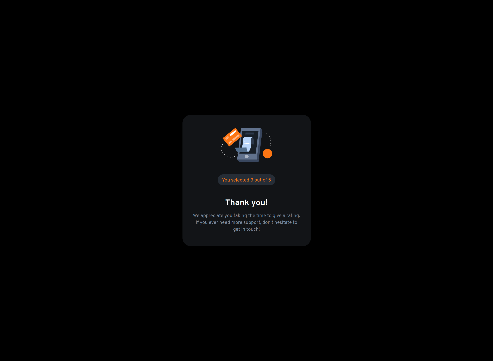
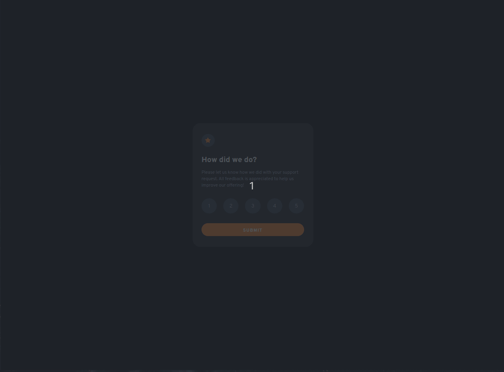

# Frontend Mentor - Interactive rating component solution

This is a solution to the [Interactive rating component challenge on Frontend Mentor](https://www.frontendmentor.io/challenges/interactive-rating-component-koxpeBUmI). Frontend Mentor challenges help you improve your coding skills by building realistic projects.

## Table of contents

- [Overview](#overview)
  - [The challenge](#the-challenge)
  - [Screenshot](#screenshot)
  - [Links](#links)
- [My process](#my-process)
  - [Built with](#built-with)
  - [What I learned](#what-i-learned)
  - [Continued development](#continued-development)
  - [Useful resources](#useful-resources)
- [Author](#author)

## Overview

### The challenge

Users should be able to:

- View the optimal layout for the app depending on their device's screen size
- See hover states for all interactive elements on the page
- Select and submit a number rating
- See the "Thank you" card state after submitting a rating

### Screenshot

#### Mobile View


#### Desktop View




#### Demo



### Links

- Solution URL: [Solution URL](https://your-solution-url.com)
- Vercel: [Vercel](https://your-live-site-url.com)

## My process

### Built with

- Semantic HTML5 markup
- [Tailwind CSS](https://tailwindcss.com/) - CSS framework
- Flexbox
- Mobile-first workflow
- [React](https://reactjs.org/) - JS library

### What I learned

This component renders the ratings, and I used some interesting logic to get around the issue of changing the background color of the currently selected radio button.

```jsx
export default function Rates({ handleChange, ratingSelected }) {
  const setColor = (currentRate) => {
    const defaultStyle =
      "h-10 w-10 rounded-full flex items-center justify-center md:h-12 md:w-12";
    const defaultColor =
      "bg-dark-blue text-light-gray hover:bg-medium-gray hover:text-white";
    const selectedColor = "bg-orange text-white";

    return currentRate === ratingSelected
      ? `${defaultStyle} ${selectedColor}`
      : `${defaultStyle} ${defaultColor}`;
  };

  return (
    <div className="flex justify-between py-1">
      {rates.map((rate) => (
        <label htmlFor={`rate-${rate}`} key={rate} className={setColor(rate)}>
          <input
            type="radio"
            value={rate}
            id={`rate-${rate}`}
            name="rate"
            onChange={(e) => handleChange(e.target.value)}
            className="hidden"
          />
          <span className="pt-1">{rate}</span>
        </label>
      ))}
    </div>
  );
}
```

### Continued development

This was the first project where I used Tailwind with React JS. I want to keep trying new things using these two technologies.

### Useful resources

- [Tailwind Documentation](https://www.tailwindcss.com) - This helped me a lot.

## Author

- GitHub - [devpatola](https://www.github.com/devpatola)
- Frontend Mentor - [@devpatola](https://www.frontendmentor.io/profile/devpatola)
